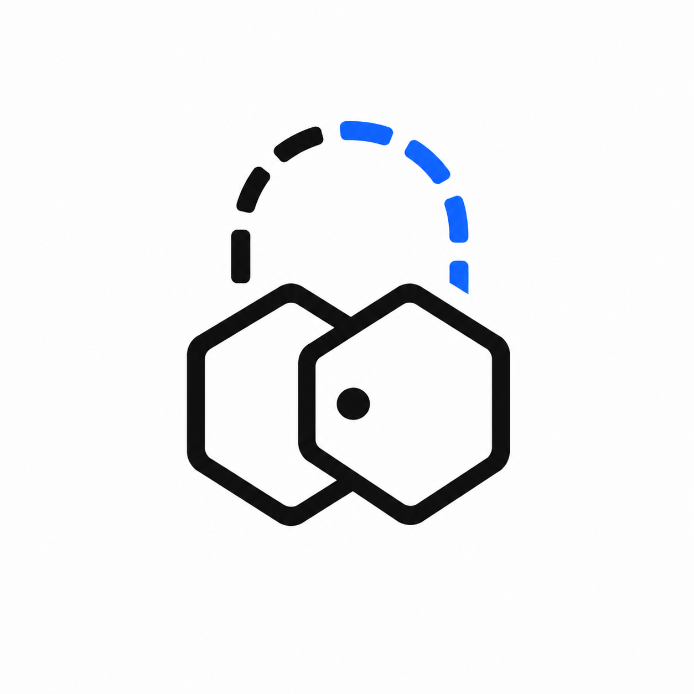

<div align="center">



# FairDrop + Umbra

### Seal made secrets programmable. We made them recoverable.

A **recoverable, on-chain-policy-gated secret no server can read** — proven across two live policies on Sui testnet.

**[Live: FairDrop](https://sui-fairdrop.vercel.app)** · **[Live: Umbra](https://sui-fairdrop.vercel.app/umbra)** · No backend · No admin key

</div>

---

## The product is not an auction. It's a primitive.

On-chain encryption has one fatal rule: the moment a secret becomes useful — a sealed bid, a private order, a key — it becomes losable. Lose the device holding the decryption key and the secret is gone forever, because no server is allowed to hold it. That single failure mode is why almost nothing of value sits behind on-chain encryption today.

We removed that rule. The primitive:

1. A client encrypts a nonce with **Seal** (threshold *t = 2* — no single key server can decrypt).
2. The ciphertext is stored on **Walrus**; the `blob_id` is referenced from an on-chain object.
3. Decryption is released **only when an on-chain Move function — `seal_approve` — approves the caller.**
4. Lose your device → sign in again (**zkLogin** re-derives the same wallet) → the chain itself authorizes the decrypt.

The secret is **recoverable**, and no backend, admin, or single key server can ever read it. The trust assumption collapses to one thing: the Sui protocol.

The two hexagons in the logo are the point — **one engine, two policies.**

---

## Two built policies (evidence the primitive works)

| Policy | What it is | `seal_approve` rule | Status |
|---|---|---|---|
| **FairDrop** | Sealed-bid fair launch you can't get locked out of | Entry owner, during the reveal window | **Deployed** |
| **Umbra** | Confidential, MEV-resistant batch settlement | Order owner, during the reveal window | **Deployed** |

**Illustrative only — NOT built, NOT claimed** (shown to prove how little code changes for a new app):

| Example | Rule it would need |
|---|---|
| Voting | member, before tally opens |
| Inheritance | anyone, after `unlock_time` |
| Procurement | supplier, during RFP window |

> Two are deployed. The others are one `assert` away. New policy, same engine.

---

## The differentiator: device-loss recovery

```
Lose device  →  open fresh browser  →  zkLogin re-derives same wallet
            →  read blob_id from on-chain object
            →  fetch Seal-encrypted nonce from Walrus
            →  Seal key servers run seal_approve(...)  ← the chain decides
            →  decryption key released  →  secret recovered  →  reveal submitted
```

No server ever saw the secret. No team helped. An **on-chain policy** allowed it.

---

## The seam (the whole thesis, in ~10 lines)

Both apps call the same engine and differ only in `seal_approve`. FairDrop's deployed policy:

```move
public fun seal_approve(
    id: vector<u8>,
    entry: &Entry,
    auction: &Auction,
    clock: &Clock,
) {
    // ciphertext is bound to THIS auction
    assert!(id == object::id_to_bytes(&object::id(auction)), EWrongAuction);
    // caller owns an Entry for it (zkLogin-gated registration)
    assert!(entry_auction_id(entry) == object::id(auction), EWrongAuction);
    // ...and only while the reveal window is open
    assert!(clock::timestamp_ms(clock) < reveal_end_ms(auction), EPhaseEnded);
}
```

Swap the object type and the asserts → a new application from the same primitive. Umbra is exactly that diff: `&Order` / `&SwapPool` instead of `&Entry` / `&Auction`.

---

## Why this is only possible on Sui

- **Seal** makes decryption a *programmable on-chain policy*, not a server check.
- **Walrus** makes the ciphertext *device-independent* with no backend.
- **Object ownership + PTBs** make the access check a capability you hold, and make settlement atomic (all refunds + winner certs in one transaction, or nothing).
- **`sui::random` (`0x8`)** — validator-DKG randomness consumed inside the settlement tx — breaks clearing-price ties unbiasably.
- **zkLogin** re-derives the same wallet on any device from the same Google login — the mechanism that makes recovery walletless.

No other stack composes these into one guarantee.

---

## Honest scoping (no overclaims)

- **zkLogin raises Sybil cost** by gating entry behind Google OAuth. It is **not** proof-of-personhood — different Google accounts derive different addresses. We do **not** claim "one human, one entry."
- **Commit-reveal is temporary blinding**, not permanent privacy.
- **Transactions are self-paid.** Enoki is used for zkLogin auth (public key) only. Sponsorship needs a private key + server, which the no-backend MVP doesn't have — so the demo wallet pays its own gas. We do **not** claim "gasless."
- Voting / inheritance / procurement are **illustrative policies**, not implemented.

---

## Deployed on testnet

| Object | Address |
|---|---|
| FairDrop package | [`0xf08336…2e13`](https://suiscan.xyz/testnet/object/0xf08336b2299d763459348f25923e07bb0a4f38767d9e1244f6fb88cd12922e13) |
| FairDrop auction | [`0xe3a9dc…1348`](https://suiscan.xyz/testnet/object/0xe3a9dca034664a0d75730f6e4c63858550787bf390befa6ae1c6858c25e21348) |
| Umbra package | [`0xe515f1…5886`](https://suiscan.xyz/testnet/object/0xe515f10377693b0d1b44434783ab7d2e5ed58dd33415bd46b34ed61f4faf5886) |
| Umbra pool | [`0x24b960…a85d`](https://suiscan.xyz/testnet/object/0x24b960574caacfdc41e668d327106fd3f4dcf09565616eaec732923bee9ca85d) |
| Randomness | `0x8` (Sui shared object) |
| Clock | `0x6` (Sui shared object) |

All publicly inspectable on SuiScan right now.

---

## Repo structure

```
contracts/                 # FairDrop — first policy
  sources/
    auction.move           # commit-reveal, uniform clearing price, random tie-break, escrow
    seal_policy.move       # seal_approve: Entry-owner-gated decryption, reveal window
  tests/                   # 25 tests (incl. exploit-replay scenarios)

umbra/                     # Umbra — second policy
  sources/
    umbra_swap.move        # blind orders, batch settlement, partial fill, MEV-Shield NFT
    umbra_policy.move      # seal_approve: Order-owner-gated decryption
    umb.move               # UMB demo coin
  tests/                   # 25 tests

frontend/
  app/
    page.tsx               # FairDrop landing + live auction
    umbra/                 # Umbra terminal (Rekt vs Shield side-by-side)
    components/            # LiveAuction, UmbraTerminal, RecoveryHero, ArchitectureFlow
  lib/
    seal.ts walrus.ts      # recovery layer: threshold encrypt/decrypt + blob store/read
    constants.ts umbra.ts  # contract IDs, tx builders, commitment hashing
    hash.ts errors.ts pyth.ts

docs/
  SUBMISSION.md            # positioning, demo script, judge beats, defense Q&A
  ARCHITECTURE.md          # system + recovery diagrams
```

---

## Run it yourself

### Contracts

```bash
# FairDrop
sui move build --path contracts/
sui move test  --path contracts/      # 25 tests

# Umbra
sui move build --path umbra/
sui move test  --path umbra/          # 25 tests
```

### Frontend

```bash
cd frontend
cp .env.local.example .env.local      # IDs in "Deployed on testnet" above
npm install
npm run dev                            # localhost:3000  (/ = FairDrop, /umbra = Umbra)
```

---

## Stack

- **Contracts** — Move 2024 (Sui), deployed to testnet. Seal access policies, `sui::random`, PTB-atomic settlement, `sui::display` (on-chain SVG art).
- **Recovery** — Seal threshold encryption (`@mysten/seal`) + Walrus blob storage, fully client-side.
- **Frontend** — Next.js 14, TypeScript, Tailwind, Framer Motion, `@mysten/dapp-kit`, zkLogin via Enoki. No backend, no server-side secrets.

---

<div align="center">

**Seal made secrets programmable. We made them recoverable.**

*Built for Sui Overflow 2026*

</div>
