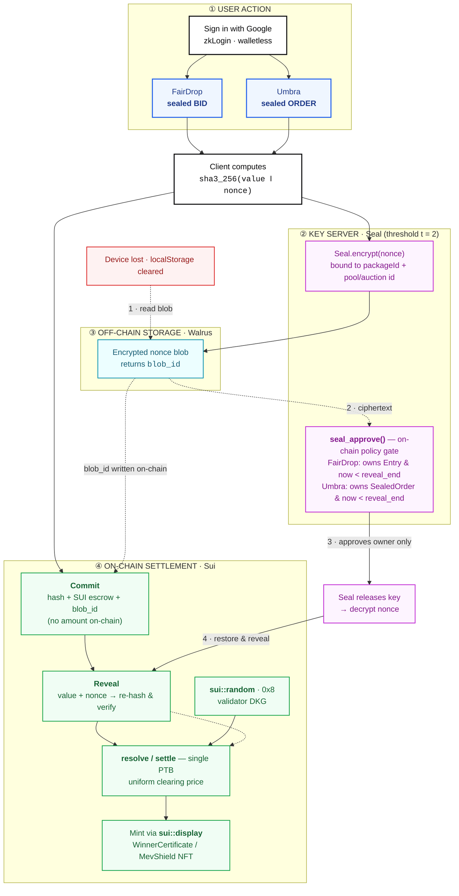
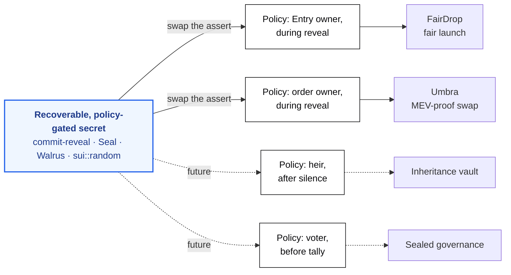
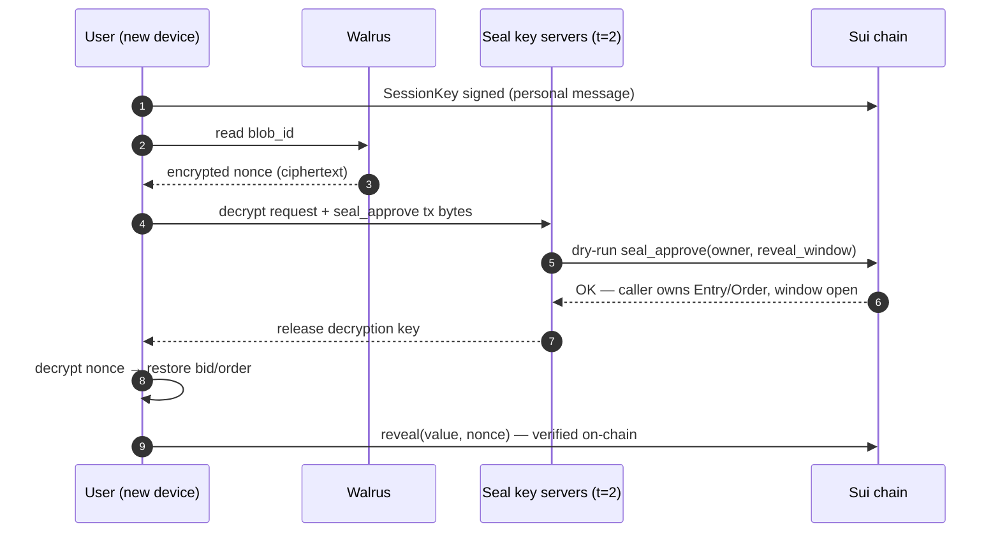

# FairDrop × Umbra — Architecture

> **One primitive, two applications.** A *recoverable, on-chain-policy-gated secret no
> server can read* — `Seal` (threshold encryption) + `Walrus` (off-chain blob storage)
> + `sui::random` (verifiable settlement). FairDrop wears the policy *"Entry owner during
> reveal."* Umbra wears *"order owner during reveal."* Same engine. Different policy.

---

## System diagram

---

## The insight — one engine, two policies

---

## Recovery sequence — "lose your device, keep your bid"

---

## Trust properties (what each zone guarantees)

| Zone | Component | Guarantee |
|---|---|---|
| ① User | zkLogin (Enoki) | Walletless entry; same login re-derives the same address on any device |
| ② Seal | threshold `t = 2` | No single key server can decrypt; release gated by an **on-chain** `seal_approve` |
| ③ Walrus | decentralized blobs | The encrypted nonce survives device loss — no team server holds it |
| ④ Sui | commit-reveal + `0x8` + PTB | Amounts hidden until reveal; winner selection is validator-DKG random; settlement is pull-based, no admin override |

**Net:** the secret is recoverable (Walrus), unreadable by any custodian (Seal `t=2` + policy),
and settled fairly and verifiably (commit-reveal + `sui::random`). No backend anywhere in the path.
